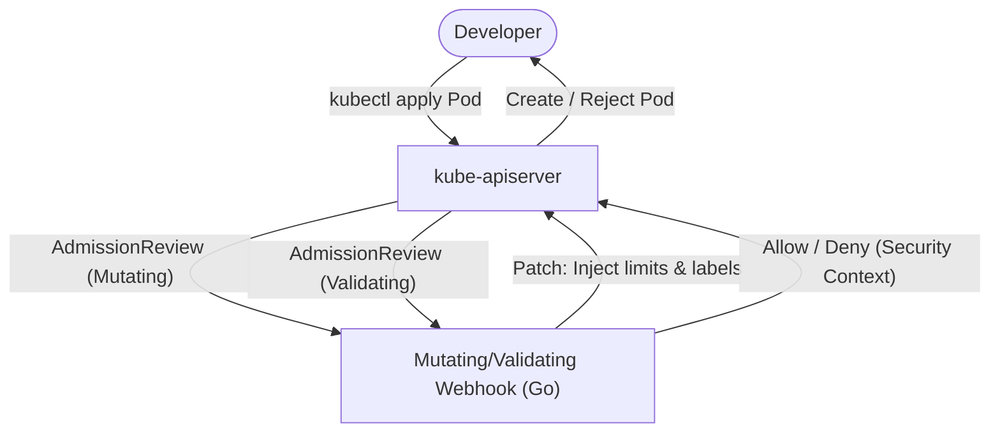

# Architecture — k8s-admission-webhook-from-scratch
> Last updated: 2026-08-29 | Maturity: Full Prototype
> _Kubernetes Validating and Mutating Admission Webhook in Go._

## System Diagram
The following Mermaid.js sequence diagram maps the core workflow and interactions:

## Component Table

| Component | File | Responsibility | Tech |
|---|---|---|---|
| Main Server | `cmd/webhook/main.go` | HTTP server listening for AdmissionReview requests | Go |
| Mutator | `pkg/mutate/mutate.go` | Injects labels and default resource limits | Go |
| Validator | `pkg/validate/validate.go` | Rejects privileged, root pods, or missing labels | Go |

## Port Assignments

| Service | Port | Notes |
|---|---|---|
| Webhook Server | `8443` | TLS enabled endpoint for AdmissionReview |

## Dependency Honesty Table

| Dependency | Status | Notes |
|---|---|---|
| Kubernetes API Server | **Real** | Webhook integrates directly with the API server. |
| OpenSSL | **Real** | Used to generate self-signed certs for local dev. |
| kind (Local Cluster) | **Optional** | Used for local testing and demo scripts. |
